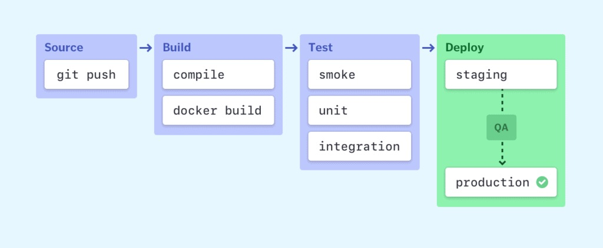
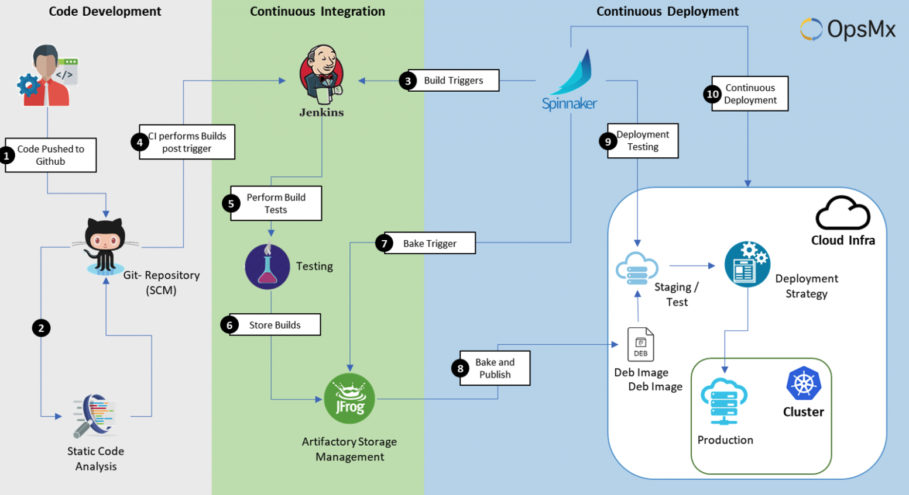

import WideImage from "../../components/blog/WideImage.astro";

<WideImage>
  
<small>Photo by <a href="https://unsplash.com/@karosu" target="_blank" rel="noreferrer">karosu</a> on <a href="https://unsplash.com" target="_blank" rel="noreferrer">Unsplash</a></small>
</WideImage>

In the modern world, software development teams under go constant pressure to deliver new features and improvements quickly and effectively.
This is where continuous integration and deployment (CI/CD) come into play.

CI/CD is a set of procedures for automating the software delivery process, from code changes to production releases.
By automating repetitive tasks and incorporating them into a streamlined flow, CI/CD assists development teams:

- Deliver updates and new features to users more quickly, enhancing agility and competitiveness.
- Reduce mistakes by catching defects early in the development process, resulting in higher-quality software.
- Release developers from manual duties, enabling them to concentrate on innovation.

## Understanding CI and CD

CI/CD, though frequently used interchangeably, refers to two different but related practices: **Continuous Integration
(CI)** and **Continuous Delivery/Deployment (CD)**.

CI emphasizes **frequent and automated code integration**. Developers routinely merge their changes into a shared
repository, which initiates automatic builds and testing. This detects mistakes early, saving time and resources.

CD expands on CI by **automating the delivery process**. After passing tests, code is immediately pushed to multiple
environments for additional testing, or even to production in some situations. This simplifies releases and guarantees consistency in quality.

Together, CI/CD creates the groundwork for quicker, more dependable software delivery.

<small>CI/CD flow</small>

## Powering Faster, Higher-Quality Releases

CI/CD isn't just a buzzword, it's a game-changer for software development. Here's how:

- **Faster releases:** Frequent code merges and automated testing mean quicker issue detection and resolution. Imagine weekly or daily updates instead of months!
- **Improved code quality:** Automated testing acts as a constant quality check, catching bugs early and ensuring code adheres to best practices. This translates to a more stable and reliable product.
- **Reduced time to market:** Faster releases and improved quality mean getting your product to market quicker, giving you a competitive edge.
- **Collaboration and continuous improvement:** CI/CD fosters collaboration and a culture of continuous learning, leading to a better codebase and happier developers.
- **Rapid Feedback:** Developers receive quick feedback on their code changes, allowing them to fix issues before they become major problems.

CI/CD is a mindset shift towards faster, higher-quality software and a more efficient development process.

## Building your CI/CD Pipeline

Now that you grasp the potential of CI/CD and its core stages, let's dive into the practical steps of building your own pipeline.

### Define your pipeline stages

The CI/CD pipeline acts as a crucial assembly line, transforming code into production-ready applications. Let's dive deeper into the core stages:

1. **Code Checkout (Version Control System Integration):**

   Utilizing tools like Git, the pipeline fetches the latest code revision from the designated version control system (VCS) repository.
   This ensures everyone involved is working on the same codebase version, promoting collaboration and preventing conflicts.

2. **Build (Compilation and Packaging):**

   This stage leverages build tools like Maven or Gradle to transform source code into an executable format or deployable artifact.
   Depending on the project's requirements, language-specific build commands are executed to compile, link, and package the code into a
   format suitable for deployment (e.g., JAR files, Docker images).

3. **Test (Automated Quality Checks):**

   This critical stage involves executing pre-defined automated tests to assess the functionality, quality, and security of the built code.
   A diverse testing suite might be employed, encompassing unit tests (focusing on individual code units), integration tests (verifying interactions between components), and potentially end-to-end tests (simulating user interactions).

4. **Deployment (Environment Delivery):**

   Once the code successfully passes the test stage, it is delivered to various environments for further validation or release.
   Depending on the CI/CD strategy, deployment might involve pushing the code to a staging environment for thorough testing before transitioning to production,
   or directly deploying the code to production in specific scenarios, often employed with robust CI/CD pipelines and high confidence in the code's stability.

<small>Stages Of CI/CD Pipeline (<a href="https://www.simform.com/blog/scalable-ci-cd-pipeline-examples/" target="_blank" rel="noreferrer">simform</a>)</small>

### Choosing Your CI/CD Platform

Choosing the proper CI/CD platform is crucial for streamlining your development process.
Here's an overview of several popular alternatives and important considerations to consider.

#### Popular CI/CD Platforms

- **Jenkins** is open-source, extremely flexible, and provides significant plugin support. However, it takes more technical knowledge to set up and maintain.
- **CircleCI** is cloud-based, has a user-friendly interface, and integrates well with a variety of tools and platforms. Customization options may be limited with compared to Jenkins.
- **GitLab CI/CD** is integrated with GitLab, providing a single platform for development and CI/CD. This may not be appropriate for projects that do not use GitLab.
- **GitHub Actions** is a part of GitHub, easy to use, and provides free plans for open-source projects. While easy to use and suitable for many projects, might require additional configuration or
  customization for particularly complex workflows or large-scale enterprise deployments.
- **Azure DevOps** is cloud-based, interacts easily with Microsoft Azure services, and provides a variety of features. Can be more costly than some other options we discussed.

#### Factors to Consider

- **Project size and complexity:** Larger or more complex projects may necessitate a platform that provides greater customization and scalability.
- **Team skill level and experience:** Consider your team's technical knowledge and select a platform with an adequate learning curve.
- **Integration with existing tools:** Make sure the platform works with your current development tools and version control system.
- **Pricing and Features:** Evaluate the cost-benefit analysis, taking into account the features available and the pricing model (open-source, subscription, etc).
- **Security and Compliance:** Prioritize platforms that fulfill your security and compliance needs.

<WideImage>
  
<small>A CICD Pipeline (<a href="https://www.opsmx.com/blog/what-is-a-ci-cd-pipeline/" target="_blank" rel="noreferrer">OpnsMx</a>)</small>
</WideImage>

## Conclusion

CI/CD represents a pivotal shift in software development. By automating processes and promoting collaboration, it enables faster,
higher-quality software delivery. Embracing this approach not only streamlines pipelines but also fosters a culture of continuous improvement.

