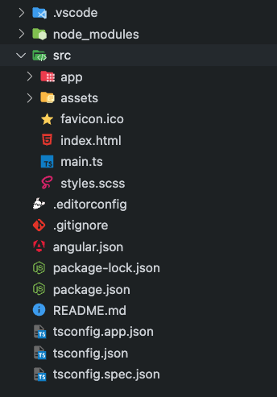
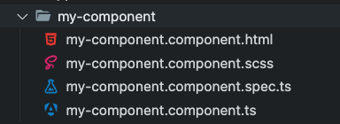

import NoShadow from "../../components/blog/NoShadow.astro";

<NoShadow></NoShadow>

In 2010, Google's Miško Hevery and Adam Abrons led an internal project to create Angular. 
This initial version, known as AngularJS, immediately became popular because to its innovative approach to single-page application (SPA) development. 
However, with the expanding landscape of web development, a complete rewrite arose in 2016: Angular (also known as "Angular 2+").

## What is Angular, and what makes it stand out?

Angular is a free, open-source framework developed in TypeScript, a superset of JavaScript. 
It allows developers to create dynamic and interactive web applications with a component-based architecture. 
This means that applications are built using modular and reusable components, each with its own template (visual structure) and logic. 
This strategy improves code organization, maintainability, and scalability.
Many developers utilize Angular for developing complex web applications, enterprise-level applications, and progressive web apps (PWAs).


## Setting Up Your Development Environment

Before you start working on projects make sure your setup is properly configured for a workflow.

1. **Setting up Node.js and npm**

   Node.js is essential, for running JavaScript outside of web browsers while npm handles packages.
   Head to nodejs.org download the installer, for your operating system. Follow the installation guidelines.
   Confirm the installation by typing `node -v` and `npm -v` in your command line.

2. **Installing Angular CLI**

   Angular CLI simplifies development tasks by offering commands to create components, services and more.
   To install it globally enter `npm install -g @angular/cli` in your command line. Check that its installed correctly by using `ng version`.

Once Node.js, npm and Angular CLI are set up on your system you're all set for development. Start building applications using Angular CLI and other tools in the Angular ecosystem.

## Creating Your First Angular App

Angular CLI makes it easier to start projects and sets up a foundation, for development.

### Steps for Creating a New Angular Project using Angular CLI

    Let's begin by opening your terminal or command prompt and entering `ng new my-app`, where `my-app`'s the chosen name for your project.
    This command initiates the creation of an project with default configurations. Then navigate to the project directory by using `cd my-app`.

### Overview of an Angular Projects Structure

    The structure of the generated project will be as below



    - `src` - Here you will find all the source code for your Angular application, such as components, templates, styles and assets.
    - `app` - The folder where most development work takes place; it includes components, services and various other Angular elements.
    - `angular.json` - This file contains configuration settings for Angular CLI that define project configurations and build preferences.
    - `package.json` - It lists the dependencies of the project as scripts for building, testing and running the application.
    - `node_modules` - This directory stores project dependencies installed by npm.
    - `index.html` - The HTML file that acts as the starting point, for your application.

## Understanding Components

Components in Angular play an important role in building Angular applications by packaging HTML templates, CSS styles and functionality into reusable units.

### Overview of Angular Components

Angular components serve as self contained and reusable elements that define both the user interface and behavior of sections within an application.
Each component consists of a TypeScript class, an HTML template and optional CSS styles. These components aid in organizing code into units simplifying the maintenance and scalability of applications.

### Creation and Usage of Components in Angular

To initiate a component, use the Angular CLI command `ng generate component my-component`.
This command automatically generates files for the component, such as the TypeScript class, HTML template and CSS styles.
Then you can incorporate this component by referencing its selector in templates to promote reusability throughout the application.



Components enable breaking down user interfaces into smaller segments for easier management while encouraging code reuse and maintainability.

## Templates, Data Binding, and Directives

In Angular, templates, data binding and directives are fundamental concepts that enable interactive web development.

### Templates in Angular

Templates in refer to HTML files that outline the layout of a components view.
They merge HTML markup with syntax to help you showcase data create user interface components and manage user interactions.
These templates are linked with components and dynamically rendered on the web page.

### Data Binding in Angular

Data binding in Angular establishes a connection between a components data (model) and its view (template) ensuring that changes made to one are
reflected in the other. There are four types of data binding;

1. **Interpolation** - Involves inserting component data into the template using braces `{{}}`.

   For example, `<h1>Welcome, {{ name }}!</h1>` would display the value of the name property

2. **Property Binding** - Links HTML element properties to component data using brackets `[]`.

   For example, `[hidden]="isLoading"` hides an element while the isLoading property is true.

3. **Event Binding** - Connects DOM events like click or input to component methods using parentheses `()`.

   For example, `(click)="handleClick()"` triggers the `handleClick` method in the component when the element is clicked.

4. **Two way Binding** - Combines property binding and event binding for a bi-directional data flow utilizing the `[(ngModel)] `syntax.

### Angular Directives

Directives in act as markers on DOM elements that instruct Angular on how to handle those elements or their children.
Angular comes with built directives such, as `ngIf` `ngFor` and `ngSwitch` to enhance templates with logic and features.
You have the flexibility to craft custom directives for expanding HTML capabilities.


```html title="app.component.html"
<h1>{{ title }}</h1>

<p>Welcome, {{ name }}!</p>

<button [hidden]="isLoading" (click)="handleClick()">Click me</button>

<ul *ngIf="isLoading">
  <li>Loading...</li>
</ul>
```


```ts title="app.component.ts"
import { Component } from '@angular/core';

@Component({
  selector: 'app-root',
  templateUrl: './app.component.html',
  styleUrls: ['./app.component.css']
})
export class AppComponent {
  title = 'My App';
  name = 'Alice';
  isLoading = false;

  handleClick() {
    alert('Button clicked!');
    this.name = 'Bob'; // Example of data change
  }
}
```

## Organizing Your Code with Services and Dependency Injection

### Services

Imagine dedicated helpers in your application, providing functionality beyond the scope of individual components.
These are services, reusable pieces of logic that handle tasks like data access, business logic, or utility functions.
They can be shared and utilized by multiple components throughout your application, promoting code organization and reducing redundancy.

### Dependency Injection

This design pattern fosters loose coupling and testability in Angular applications.
Instead of directly creating dependencies within components, Angular employs dependency injection.

Here's how it works:

1. **Components declare their dependencies**: Components specify the services they require in their constructor parameters.
2. **Angular injects dependencies**: When creating a component, Angular identifies the required services and injects them into the component's constructor, making them readily available for use.

This approach promotes several benefits:

- **Improved code maintainability**: Dependencies are explicitly defined, simplifying code understanding and modification.
- **Easier testing**: Components can be tested in isolation by providing mock dependencies, making testing more efficient and reliable.
- **Flexibility**: The way dependencies are provided can be customized, enabling advanced scenarios like lazy loading or dynamic service configuration.

Here's an example code demonstrating Angular services and dependency injection

```ts title="app.component.ts"
import { Component } from '@angular/core';
import { DataService } from './data.service';

@Component({
  selector: 'app-root',
  templateUrl: './app.component.html',
  styleUrls: ['./app.component.css']
})
export class AppComponent {
  message: string;

  constructor(private dataService: DataService) {
    this.message = this.dataService.getData(); // Inject and access service data
  }

  updateData() {
    this.dataService.setData('Data updated!'); // Modify service data
    this.message = this.dataService.getData(); // Update component message
  }
}
```

```ts title="data.service.ts"
import { Injectable } from '@angular/core';

@Injectable({
  providedIn: 'root' // Makes the service available throughout the application
})
export class DataService {
  private data: string = 'This is data from the service.';

  getData() {
    return this.data;
  }

  setData(newData: string) {
    this.data = newData;
  }
}
```

The component declares its need for the `DataService` by including it in its constructor's parameters.
This signifies to Angular that the component relies on the service for its functionality.

When Angular creates an instance of the component, it sees this dependency and automatically injects an instance of the `DataService` into the component.
This provides the component with ready access to the service's methods and data

By leveraging services and dependency injection, you can structure your Angular applications for better maintainability, testability, and scalability.

## Navigating Your Application with Angular Router

Imagine exploring different rooms in a house; Angular Router provides a similar experience for navigating between various sections (components)
in your application. This built-in feature helps users seamlessly switch between different views (components) based on the URL they access.

#### Configuring Routes

1. You specify routes in an array within a `Routes` object. Each route is a configuration object with properties like:

   - **path:** The URL path that corresponds to the route. For example, `'/about'` might map to an "About" component.
   - **component:** The component to be displayed when the route is matched.

    ```ts title="app-routing.module.ts"
    import { NgModule } from '@angular/core';
    import { RouterModule, Routes } from '@angular/router';
    import { HomeComponent } from './home/home.component';
    import { AboutComponent } from './about/about.component';

    const routes: Routes = [
    { path: '', component: HomeComponent }, // Default route
    { path: 'about', component: AboutComponent },
    ];

    @NgModule({
    imports: [RouterModule.forRoot(routes)],
    exports: [RouterModule]
    })
    export class AppRoutingModule { }
    ```

2. Then, in your main template (`app.component.html`), use `routerLink` on anchor tags to link to different components and include `<router-outlet>` where the content of those components should be displayed based on the selected route.

    ```html title="app.component.html"
    <nav>
    <a routerLink="/" routerLinkActive="active" ariaCurrentWhenActive="page">
        Home
    </a>
    <a routerLink="/about" routerLinkActive="active" ariaCurrentWhenActive="page">
        About
    </a>
    </nav>

    <router-outlet></router-outlet>
    ```

   Import `AppRoutingModule` to make routing functionality available throughout the application.

    ```ts title="app.module.ts"
    import { NgModule } from '@angular/core';
    import { BrowserModule } from '@angular/platform-browser';
    import { AppComponent } from './app.component';
    import { AppRoutingModule } from './app-routing.module';
    import { HomeComponent } from './home/home.component';
    import { AboutComponent } from './about/about.component';

    @NgModule({
    declarations: [AppComponent, HomeComponent, AboutComponent],
    imports: [
        BrowserModule,
        AppRoutingModule, // Import AppRoutingModule here
    ],
    providers: [],
    bootstrap: [AppComponent],
    })
    export class AppModule {}
    ```

#### Handling Navigation

- **Navigation links:** Use the `routerLink` directive on anchor tags (`<a>`) to define navigation links within your templates.
  For example, `<a routerLink="/about">About Us</a>` creates a link that navigates to the "About" component when clicked.
- **Programmatic navigation:** You can use the `Router` service to programmatically navigate between routes within your component logic.

    ```ts title="app.component.ts"
    import { Component } from '@angular/core';
    import { Router } from '@angular/router';

    @Component({
    selector: 'app-root',
    templateUrl: './app.component.html',
    standalone: true
    })
    export class AppComponent {
    constructor(private router: Router) {}

    navigateToAbout() {
        this.router.navigate(['/about']); // Programmatic navigation to the '/about' route
    }
    }
    ```

## Building Interactive Forms with Angular

### Angular Forms

Capturing user input is essential for many web applications. Angular provides two approaches to handle forms:

#### Template-driven forms

They offer a simplified approach for building forms directly within your component templates using HTML elements and directives.
They are suitable for simpler forms with less complex validation requirements.

```html title="user-form.component.html"
<form (ngSubmit)="onSubmit()">
  <div>
    <label for="name">Name:</label>
    <input type="text" id="name" name="name" [(ngModel)]="userModel.name" required>
  </div>
  
  <div>
    <label for="email">Email:</label>
    <input type="email" id="email" name="email" [(ngModel)]="userModel.email" required>
  </div>
  
  <div>
    <label for="age">Age:</label>
    <input type="number" id="age" name="age" [(ngModel)]="userModel.age" required>
  </div>
  
  <button type="submit">Submit</button>
</form>
```

    - We're using `[(ngModel)]` to bind form input fields to properties of the `userModel` object. This allows two-way data binding between the form inputs and the component class.
    - `(ngSubmit)` is an event binding that triggers the `onSubmit()` method when the form is submitted.
    - We use `required` attribute to make fields mandatory.

**Do not forget to import `FormsModule` in your Angular module.**

#### Reactive forms

They provide more control and flexibility by managing the form state and validation logic programmatically in the component class.
This approach is ideal for complex forms with intricate validation rules.

Here's an example of how to implement a simple reactive form in Angular.

First, let's create a new component called `ReactiveUserFormComponent`.

```ts title="reactive-user-form.component.ts"
import { Component, OnInit } from '@angular/core';
import { FormBuilder, FormGroup, Validators } from '@angular/forms';

@Component({
  selector: 'app-reactive-user-form',
  templateUrl: './reactive-user-form.component.html'
})
export class ReactiveUserFormComponent implements OnInit {
  userForm: FormGroup;

  constructor(private formBuilder: FormBuilder) {}

  ngOnInit() {
    this.userForm = this.formBuilder.group({
      name: ['', Validators.required],
      email: ['', [Validators.required, Validators.email]],
      age: [null, [Validators.required, Validators.min(18)]]
    });
  }

  onSubmit() {
    if (this.userForm.valid) {
      console.log('Form submitted with data:', this.userForm.value);
      // Here, you can perform actions like sending data to a server
    } else {
      console.error('Form is invalid');
    }
  }
}
```

In here, we are utilizing Angulars `FormBuilder` service to establish a `FormGroup` containing three form elements; name, email and age.
We've integrated validation rules to ensure that the name and email inputs are mandatory the email input is an email address and the age input is,
at 18 years old.

Now, let's create the corresponding template file `reactive-user-form.component.html`

```html title="reactive-user-form.component.html"
<form [formGroup]="userForm" (ngSubmit)="onSubmit()">
  <div>
    <label for="name">Name:</label>
    <input type="text" id="name" formControlName="name">
    <div *ngIf="userForm.get('name').invalid && userForm.get('name').touched">
      <span *ngIf="userForm.get('name').errors.required">Name is required.</span>
    </div>
  </div>
  
  <div>
    <label for="email">Email:</label>
    <input type="email" id="email" formControlName="email">
    <div *ngIf="userForm.get('email').invalid && userForm.get('email').touched">
      <span *ngIf="userForm.get('email').errors.required">Email is required.</span>
      <span *ngIf="userForm.get('email').errors.email">Invalid email format.</span>
    </div>
  </div>
  
  <div>
    <label for="age">Age:</label>
    <input type="number" id="age" formControlName="age">
    <div *ngIf="userForm.get('age').invalid && userForm.get('age').touched">
      <span *ngIf="userForm.get('age').errors.required">Age is required.</span>
      <span *ngIf="userForm.get('age').errors.min">Age must be at least 18.</span>
    </div>
  </div>
  
  <button type="submit" [disabled]="userForm.invalid">Submit</button>
</form>
```

In this template, we bind the FormGroup to the `<form>` element using `[formGroup]="userForm"`.
Each input field is associated with a form control using formControlName.
We also show error messages if the form control is invalid and has been touched by the user.

**Do not forget to import the `ReactiveFormsModule` in your Angular module**

### Validating User Input

To ensure data accuracy, Angular offers various built-in validation features:

- **Validators:** These are functions that check the validity of form controls (individual input fields).
  Angular provides pre-built validators for common scenarios like checking if a field is required, has a minimum length, or matches a specific pattern.
  You can also create custom validators for unique validation needs.
- **Error messages:** Define error messages associated with specific validation failures.
  These messages are displayed to the user when a validation error occurs, providing guidance on correcting their input.

Yes, we used validators and error messages previously in our reactive forms example.

## Interacting with the World - Utilizing Angulars HTTP Client, for API Integration

Angular provides a tool to connect with services. The **HTTP client module**. This feature enables your application to send HTTP requests to APIs
(Application Programming Interfaces). Fetch data from servers located remotely.

**Sending HTTP Requests:**

1. **Import the HttpClient:** Start by importing the `HttpClient` from `@angular/common/http` in your component.
2. **Inject the HttpClient:** Inject the `HttpClient` into your components constructor to access its functionalities.
3. **Make the request:** Use the appropriate `HttpClient` method based on the HTTP verb (GET, POST, PUT, DELETE) and specify the URL along with any parameters when making the call.

   For example, `this.http.get<ExampleInterface>('https://api.example.com/data')` fetches data from the specified URL using an HTTP GET request.

**Integrating APIs:**

- Once you've retrieved data from an API, you can process and display it within your component using data binding techniques
  like property binding and interpolation.
- Depending on the APIs features there might be a need to send data to the server via HTTP POST, PUT or DELETE requests.
  The procedure remains similar; however ensure that you include the payload (data being sent), in the request options.

Here is a sample of how you can utilize Angulars `HttpClient` module to dispatch HTTP requests to an API.

First, ensure that you have included `HttpClientModule` in your module (`app.module.ts`).

Then, let's create a service to handle API requests. Create a file named `data.service.ts`

```ts title="data.service.ts"
import { Injectable } from '@angular/core';
import { HttpClient } from '@angular/common/http';
import { Observable } from 'rxjs';
import { ApiResponse } from '.../interfaces/api-response.interface';
import { PostData } from '.../interfaces/post-data.interface';

@Injectable({
  providedIn: 'root'
})
export class DataService {

  constructor(private http: HttpClient) { }

  getData(): Observable<ApiResponse> {
    return this.http.get<ApiResponse>('https://api.example.com/data');
  }

  postData(data: PostData): Observable<ApiResponse> {
    return this.http.post<ApiResponse>('https://api.example.com/data', data);
  }
}
```

Finally, let's use this service in our component.

```ts title="app.component.ts"
import { Component } from '@angular/core';
import { DataService } from './data.service';
import { ApiResponse } from './api-response.interface';
import { PostData } from './post-data.interface';

@Component({
  selector: 'app-root',
  templateUrl: './app.component.html',
  styleUrls: ['./app.component.css']
})
export class AppComponent {
  responseData: ApiResponse;
  postData: PostData = { name: '', email: '', age: 0 };
  postResponse: ApiResponse;

  constructor(private dataService: DataService) { }

  fetchData(): void {
    this.dataService.getData().subscribe(
      (data: ApiResponse) => {
        this.responseData = data;
        console.log('Received data:', this.responseData);
        // Process and display data as needed
      },
      (error: any) => {
        console.error('Error fetching data:', error);
      }
    );
  }

  sendData(): void {
    this.dataService.postData(this.postData).subscribe(
      (response: ApiResponse) => {
        this.postResponse = response;
        console.log('Response from server:', this.postResponse);
        // Handle response from server
      },
      (error: any) => {
        console.error('Error sending data:', error);
      }
    );
  }
}
```

## Keeping Your Angular Project Clean and Efficient

By following these best practices and tips, you can ensure your Angular projects are well-organized, maintainable,
and performant, contributing to successful and sustainable web application development.

**Project Organization:**

- **Feature Modules:** Break down your application into feature modules based on functionality. This promotes modularity and simplifies maintenance of larger projects.
- **Consistent Naming:** Adopt consistent naming conventions for components, services, files, and variables. This improves code readability and collaboration.
- **Utilize Folders:** Organize code logically using folders for components, services, modules, and assets. This enhances project structure and navigation.

**Clean and Maintainable Code:**

- **Follow Style Guide:** Adhere to the <a href="https://angular.dev/style-guide"  target="_blank" rel="noreferrer">Angular style guide</a> for consistent and readable code.
- **Comments:** Include clear and concise comments explaining complex logic or non-obvious code sections.
- **Linting:** Use tools like ESLint to enforce code style and catch potential errors early in the development process.
- **Write Unit Tests:** Implement unit tests for components and services to ensure their functionality and prevent regressions in future changes.

**Performance Optimization:**

- **Lazy Loading:** Load modules only when needed, improving initial application load time. Utilize the `RouterModule.forChild` method and the `loadChildren` property for lazy loading modules.
- **Change Detection Optimization:** Identify and address unnecessary change detections in your components to improve performance. Utilize techniques like `OnPush` change detection strategy and `trackBy` in your `*ngFor` loops.
- **Code Splitting:** Split your application code into smaller bundles to minimize initial payload size downloaded by the user.
- **Performance Profiling:** Use browser developer tools to identify performance bottlenecks and profile your application to identify areas for improvement.

## Continuing Your Angular Journey: Next Steps

**Deepen Your Knowledge:**

- **Official Angular Documentation:** The comprehensive <a href="https://angular.dev"  target="_blank" rel="noreferrer">Angular</a> website
  is your source of truth for everything Angular, offering detailed guides, tutorials, and API references.
- **Interactive Tutorials and Courses:** Explore interactive tutorials and online courses offered on various platforms
  to apply your learning through practical exercises and projects.

  Some recomended options:

  - <a href="https://angular.dev/tutorials" target="_blank" rel="noreferrer">
      The Angular Tutorials
    </a>
  - <a
      href="https://www.pluralsight.com/paths/angular"
      target="_blank"
      rel="noreferrer"
    >
      Angular Fundamentals by Pluralsight
    </a>
  - <a
      href="https://www.udemy.com/course/the-complete-guide-to-angular-2"
      target="_blank"
      rel="noreferrer"
    >
      Angular - The Complete Guide by Maximilian Schwarzmüller
    </a>

- **Join the Angular Community:** Engage with the vibrant Angular community through forums, discussions, and events.
  Sharing knowledge and asking questions can be an invaluable learning experience.

**Build and Contribute:**

- **Start Building:** Put your newfound knowledge into action! Begin with smaller projects and gradually work your way up to more complex applications.
  Experimenting and building projects is the best way to solidify your understanding and gain practical experience.
- **Contribute to the Open-Source Ecosystem:** Consider contributing to open-source libraries or projects related to Angular.
  This is a fantastic way to give back to the community, showcase your skills, and collaborate with other developers.

Remember, the path to becoming an proficient Angular developer is an ongoing journey of learning, practicing, and building.
Embrace the process, stay curious, and actively engage with the community. By constantly learning and putting your skills into practice,
you'll be well on your way to crafting impressive and impactful web applications with Angular!


