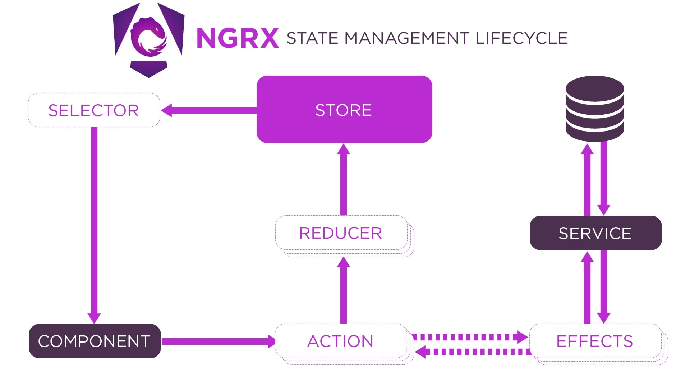

import WideImage from "../../components/blog/WideImage.astro";

When it comes to developing in Angular, creating applications that can grow and be easily maintained is essential. 
A vital factor in making this happen is handling the application's state. In this blog article, we will delve into utilizing NgRx, 
a state management tool, for apps to establish reliable and expandable state management within an e-commerce platform.

<WideImage>
  
</WideImage>


## State Management with NgRx

NgRx is centered on the Redux pattern, a known design principle that excels in structuring application state in a way that is reliable and adaptable. 
NgRx focuses on elements like actions, reducers, effects and selectors, all crucial in managing state effectively within Angular applications.


<WideImage>
  
  <small>NgRx: State management lifecycle</small>
</WideImage>

## Defining the Application State

Lets take a look at how an e commerce app's doing. 
In this scenario we have to handle things like products, user details, items in the cart and so on. 
For this blog post lets dive into handling the status of products available, in the store. Here's how we outline the setup of our apps state;

```ts title=product.state.ts

import { Product } from './product.model';

export interface ProductState {
  products: Product[];
  loading: boolean;
  error: string | null;
}
```

## Actions

Events in our application are represented by actions. 
For instance in our online store app we will specify actions like loading products adding items to the cart and managing errors. 
Let me show you an example of how we define actions, for loading products;

```ts title=product.actions.ts

import { createAction, props } from '@ngrx/store';
import { Product } from './product.model';

export const loadProducts = createAction('[Product] Load Products');
export const loadProductsSuccess = createAction('[Product] Load Products Success', props<{ products: Product[] }>());
export const loadProductsFailure = createAction('[Product] Load Products Failure', props<{ error: string }>());
```

Then you can use your actions like this in your components.

```ts title=product-list.component.ts
import { Component, OnInit } from '@angular/core';
import { Store } from '@ngrx/store';
import { Observable } from 'rxjs';
import { loadProducts } from './product.actions';

@Component({
  selector: 'app-product-list',
  templateUrl: './product-list.component.html',
  styleUrls: ['./product-list.component.css']
})
export class ProductListComponent implements OnInit {

  constructor(private store: Store) {}

  ngOnInit(): void {
    // Dispatch action to load products
    this.store.dispatch(loadProducts());
  }
}
```

## Reducers

Reducers determine how the state of an application evolves based on actions. 
By creating a reducer function that accepts the state and an action as inputs, it will produce a new state as output where we can manage changes effectively. 
Lets consider this example of a reducer designed to handle actions related to products;

```ts title=product.reducer.ts
import { createReducer, on } from '@ngrx/store';
import { ProductState } from './product.state';
import * as ProductActions from './product.actions';

const initialState: ProductState = {
  products: [],
  loading: false,
  error: null
};

export const productReducer = createReducer(
  initialState,
  on(ProductActions.loadProducts, state => ({ ...state, loading: true })),
  on(ProductActions.loadProductsSuccess, (state, { products }) => ({
    ...state,
    products,
    loading: false,
    error: null
  })),
  on(ProductActions.loadProductsFailure, (state, { error }) => ({
    ...state,
    loading: false,
    error
  }))
);
```

## Effects

Effects handle side effects such as asynchronous operations (e.g., HTTP requests). 
We define an effect to load products from a server using a `ProductService` and dispatch appropriate actions based on the result. 
Here's an example of defining an effect for loading products:

```ts title=product.effects.ts
import { Injectable } from '@angular/core';
import { Actions, createEffect, ofType } from '@ngrx/effects';
import { of } from 'rxjs';
import { catchError, map, switchMap } from 'rxjs/operators';
import { ProductService } from './product.service';
import * as ProductActions from './product.actions';

@Injectable()
export class ProductEffects {

  loadProducts$ = createEffect(() => this.actions$.pipe(
    ofType(ProductActions.loadProducts),
    switchMap(() =>
      this.productService.getProducts().pipe(
        map(products => ProductActions.loadProductsSuccess({ products })),
        catchError(error => of(ProductActions.loadProductsFailure({ error: error.message })))
      )
    )
  ));

  constructor(
    private actions$: Actions,
    private productService: ProductService
  ) {}
}
```

## Selectors

Selectors are used to extract specific pieces of state from the store. 
We define selectors to select products, loading state, and error state from the product state. Here's an example of defining selectors.

```ts title=product.selectors.ts

import { createFeatureSelector, createSelector } from '@ngrx/store';
import { ProductState } from './product.state';

const getProductState = createFeatureSelector<ProductState>('products');

export const getProducts = createSelector(
  getProductState,
  state => state.products
);

export const getLoading = createSelector(
  getProductState,
  state => state.loading
);

export const getError = createSelector(
  getProductState,
  state => state.error
);
```

Then you can use your selectors like this.

```ts title=product-list.component.ts ins={5-6} ins={14-16} ins={24-27} ins=", select"
import { Component, OnInit } from '@angular/core';
import { Store, select } from '@ngrx/store';
import { Observable } from 'rxjs';
import { loadProducts } from './product.actions';
import { Product } from './product.model';
import { getProducts, getLoading, getError } from './product.selectors';

@Component({
  selector: 'app-product-list',
  templateUrl: './product-list.component.html',
  styleUrls: ['./product-list.component.css']
})
export class ProductListComponent implements OnInit {
  products$: Observable<Product[]>;
  loading$: Observable<boolean>;
  error$: Observable<string>;

  constructor(private store: Store) {}

  ngOnInit(): void {
    // Dispatch action to load products
    this.store.dispatch(loadProducts());

    // Select products, loading state, and error state from the store
    this.products$ = this.store.pipe(select(getProducts));
    this.loading$ = this.store.pipe(select(getLoading));
    this.error$ = this.store.pipe(select(getError));
  }
}
```

```html title=product-list.component.html
<div *ngIf="loading$ | async">Loading...</div>
<div *ngIf="error$ | async as error">Error: {{ error }}</div>
<ul *ngIf="products$ | async as products">
  <li *ngFor="let product of products">
    {{ product.name }} - {{ product.price }}
  </li>
</ul>
```

## Integration with AppModule

To integrate NgRx into our Angular application, we import the `StoreModule.forRoot` method and provide reducers and effects in the `AppModule`. 
Here's how we integrate NgRx into our `AppModule`.


```ts title=app.module.ts ins={17-18}
import { NgModule } from '@angular/core';
import { BrowserModule } from '@angular/platform-browser';
import { HttpClientModule } from '@angular/common/http';
import { StoreModule } from '@ngrx/store';
import { EffectsModule } from '@ngrx/effects';
import { AppComponent } from './app.component';
import { ProductEffects } from './product.effects';
import { productReducer } from './product.reducer';

@NgModule({
  declarations: [
    AppComponent
  ],
  imports: [
    BrowserModule,
    HttpClientModule,
    StoreModule.forRoot({ products: productReducer }),
    EffectsModule.forRoot([ProductEffects])
  ],
  providers: [],
  bootstrap: [AppComponent]
})
export class AppModule { }
```

> Pretty dope, isn't it?


## Conclusion
NgRx offers a solution for handling state in Angular applications especially in situations like e-commerce web apps where state complexity can arise. 
By utilizing NgRxs actions, reducers, effects and selectors you can create scalable and easy to manage state management solutions. 


In our e-commerce case study we showcased how NgRx can effectively handle product state management setting the stage for Angular applications.
Mastering state management with NgRx equips you to craft top notch applications that align with the evolving needs of modern web development.


