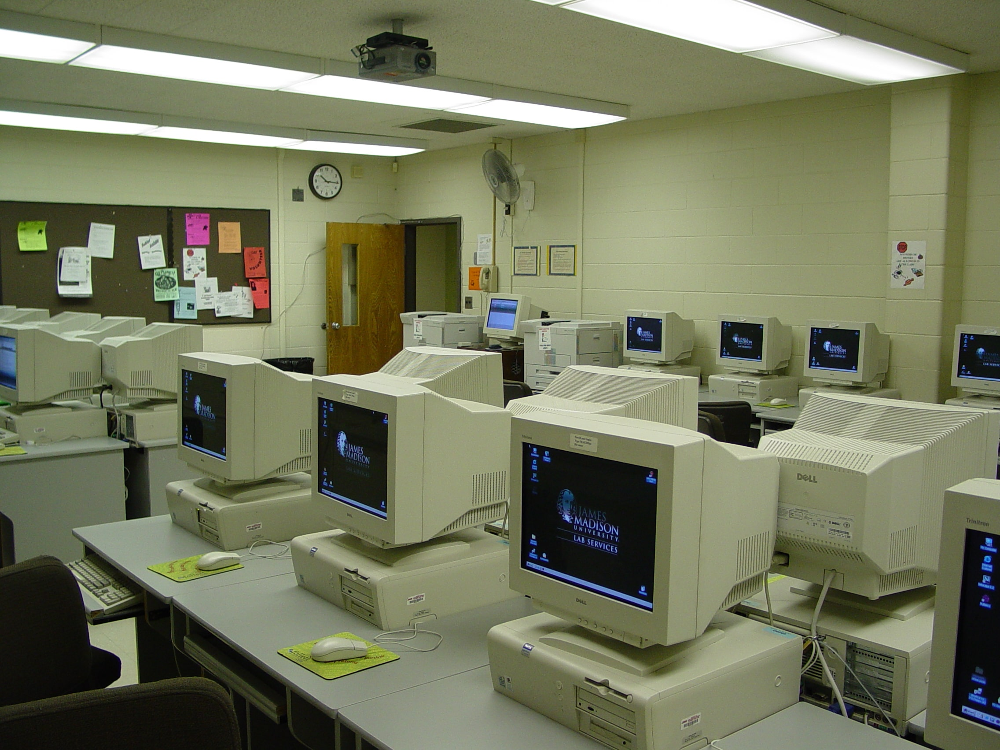

import WideImage from "../../components/blog/WideImage.astro";

## Unraveling the Digital Universe at age 9

In 2002, when I was nine years old, I stepped into <a target="_blank" rel="noreferrer" href="https://www.tecsrilanka.com.lk/">TEC Sri Lanka</a>,
a place filled with computers and cutting edge technology. It felt like entering a new world! Little did I know then that this
experience would ignite my passion, for all things related to computers.

Back in those days computers seemed magical. They had the power to perform tasks! At TEC Sri Lanka I didn't just
learn how to type or use a mouse, I delved deeper. Discovered the art of communicating with these machines. I
acquired skills in crafting websites using HTML and CSS and even grasped the fundamentals of programming. It was
like unlocking the language of technology!

<small>A GW BASIC lesson from 2003</small>

By the time I turned fifteen my collection of certificates showcased my mastery of computer skills. However, it
wasn't about achieving certifications, it was about the thrill of seeing my code come to life solving problems
through thinking and realizing that technology opened endless possibilities.

This is the beginning of my journey. The simple code that captivated me at nine has evolved into software
systems while basic web pages have transformed into applications.

## Adventures in Dad's Computer Lab

I didn't want to go to school; instead, I wanted to go to my dad's school computer lab. He was a teacher in
charge there. Since we didn't have a computer at home, I spent about three to four years turning that lab into
my own tech haven. From like sixth to eighth grade, it felt like my second home. Sure, games were fun, but what
really got me going was coding. I loved messing around with Visual Basic 6.0, creating simple stuff like
calculators and forms. Even though they were basic, seeing my code actually work was so exciting!

Learn to code in a lab was a slow process, but it taught me to be really resourceful and great at
problem-solving! The lab might not have been fancy, but it's where my passion for coding really blossomed. It
taught me more than just technical skills, it showed me the importance of determination, resourcefulness, and
always being eager to learn - qualities that still come in handy as a software engineer today.

## The Arrival of My First Computer

Ah, the struggle of relying on borrowed computers! But then, imagine this! A gleaming new computer proudly
displayed in our living room, thanks to my amazing dad! It wasn't just any computer, it was a gateway to a whole
new world of digital adventures. No more limitations of the school lab, this was our own digital haven, shared
with my brother, who was just as tech-savvy.

But let's be honest, were we all about serious stuff like coding? Not really! Like most kids, we were all about
the games. We dove headfirst into classics like Age of Empires, Mortal Kombat, and Need for Speed, spending
endless hours competing (and sometimes teaming up!). Those virtual worlds weren't just for fun, they were
moments of bonding, sparking friendly competition and lots of laughter.

## Invested more in education

It wasn't just about playing games, they opened the door to my growing curiosity about technology. Eager to
learn more, I pursued higher education during my GCE A/L years, opting for an interesting mix of subjects: IT,
Economics, and History.

But my quest for knowledge didn't end there. While juggling my GCE A/L studies, I delved deeper into the
practical side of technology with the

<a target="_blank" rel="noreferrer" href="https://www.nccedu.com/">NCC Education</a> 
international diploma in computing at <a target="_blank" rel="noreferrer"  href="https://www.idmedu.lk/">IDM Nations Campus</a>. 
This program gave me hands-on experience with programming languages, web development,
and networking principles. Mixing theory with practice was key. GCE A/L provided
the groundwork, and the NCC diploma honed my technical skills and enriched my understanding
of core computing concepts. It was like laying the foundation and then mastering
it in real-world scenarios.

Looking back on it now, the combination of both academic paths proved incredibly valuable. My diverse background
gave me a unique perspective, turning me into more than just a skilled coder. I became someone who could not
only write code but also analyze, explain, and put technology into context. This broad understanding became a
significant asset in my future career as a software engineer.

## Campus years

Life isn't always a clear-cut path, sometimes it's a winding road full of unexpected turns. My journey through
GCE A/L had its fair share of uphill battles, but amidst the struggle, it opened doors to a realm of new
possibilities. Together with a friend, we dared to take on a new challenge - pursuing a software engineering
degree at <a target="_blank" rel="noreferrer" href="https://www.sliit.lk">Sri Lanka Institute of Information Technology (SLIIT)</a>
, a beacon of opportunity in Sri Lanka's educational landscape.

<WideImage>
  
  <small>SLIIT Campus Malabe</small>
</WideImage>

While GCE A/L may not have showcased my brightest academic moments, it served as a tough situation that helps
you become stronger, teaching me invaluable lessons in determination, adaptability, and courage. During those
times, I discovered inner strengths I never knew I had, pushing me onward to new and unfamiliar paths.

SLIIT, though, was like a whole new world opening up before me. It wasn't merely a campus, it was a melting pot
of transformation, sculpted to shape aspiring software engineers into adept innovators. Here, I immersed myself
in the complex algorithms, data structures, object-oriented programming, and the ever-evolving art of software
design. Each new concept, each line of code, was a portal to uncharted realms of possibility, each keystroke a
step closer to unlocking the secrets of the digital universe.

<small>SLIIT Inauguration Day</small>

But SLIIT wasn't just a classroom, It was a melting pot of creativity, where ideas bubbled and flourished, where
theory met practice in a symphony of innovation. Through hands-on projects and exhilarating hackathons, I
discovered the true essence of software engineering - the thrill of seeing lines of code spring to life, the joy
of unraveling complex problems with elegant solutions, and the profound satisfaction of creating something
meaningful that transcended the virtual realm.

Certainly, it wasn't all smooth sailing. Wrestling with tricky algorithms, debugging errors in my code, and
burning the midnight oil to meet project deadlines became familiar companions on my journey. But with each
hurdle, I emerged more resilient, more resourceful, and even more determined to carve out my path in the world
of coding.

Reflecting on my time at SLIIT, I realize it was a melting pot of growth for me. It not only honed my technical
skills but also sharpened my problem-solving abilities and nurtured my ability to collaborate effectively with
others. Yet, perhaps most importantly, it deepened my love for software engineering, transforming me from a
curious novice into a confident and skilled practitioner in this field.

Imagine diving headfirst into challenging tasks, fueled by the power of Object-Oriented Programming (OOP),
finding pure joy in untangling software puzzles through troubleshooting, and experiencing the exhilaration of
bringing ideas to life using languages like JavaScript and C#. Each new concept felt like discovering a missing
puzzle piece, and every project propelled me forward on my journey to becoming a well-rounded developer.

<small>A lecture room at SLIIT</small>

Exposing into mobile app development was like stepping into a world of endless possibilities. Creating apps that
connected people, solved real-world problems, or simply brought joy was incredibly fulfilling. Similarly,
delving into web development allowed me to develop interactive experiences that captivated users online.

But my journey didn't end there, it took me deeper into the digital realm. Exploring backend development with
technologies like HTML and RESTful APIs peeled back the layers, revealing the intricate systems that powered
websites. It was like peeking behind the curtain to unravel the hidden mechanics that made websites tick.

Full stack development felt like solving a puzzle. It wasn't about mastering skills, it involved understanding
how all the different parts of a website worked together harmoniously. It was similar to being a conductor
orchestrating every element to provide users with an enjoyable experience.

During my time at SLIIT I not only improved my abilities but also sharpened my research skills. I explored the
world of image processing. Dipped my toes into game development. Each new experience expanded my horizons making
me more adaptable and resourceful than before.

At SLIIT, group projects were like forging grounds for me. They weren't just assignments, they were
opportunities to bond with classmates, face challenges together, and celebrate victories as a team. Working
alongside others taught me the power of collaboration and the value of pooling our strengths to overcome
obstacles. Through these projects, I learned not only how to code but also how to communicate effectively,
compromise when needed, and trust in the abilities of my teammates. In essence, group projects were the heart of
my SLIIT experience, shaping me into a more collaborative, empathetic, and resilient individual.

<WideImage>
  
  <small>SLIIT Graduation Day</small>
</WideImage>
The knowledge and skills I acquired at SLIIT were priceless. They provided me with
the tools to navigate the evolving technology landscape tackle various challenges
and adapt to new tools and techniques. However, what truly mattered was that they
ignited and fueled my passion for creating, problem solving and leveraging code as
a catalyst, for change.

## My first job - the dream came true

My time at SLIIT was a whirlwind of experiences, filled with both challenges and moments of growth. As
graduation approached, I found myself standing at a crossroads, uncertain about what the future held. With a mix
of nervousness and excitement, I embarked on the journey of finding a job, eager to see where my newfound skills
would take me. It was during this search that a friend mentioned an internship opportunity at

<a target="_blank" rel="noreferrer" href="https://www.findmyfare.com">Findmyfare.com</a>, 
a travel tech startup with a lot of potential. Little did I know, this internship
would mark the beginning of my adventure into the professional world of software
engineering.

<small>findmyfare.com IT department</small>

Immersed in the dynamic environment of a startup, I encountered real-world challenges, collaborated with
seasoned developers, and gained invaluable insights into the industry. Then, to my surprise and delight, came
the offer I had been dreaming of - a chance to join Findmyfare full-time as a graduate developer!

My transition into my first role as a full-stack developer felt like stepping into a live coding adventure.
Instead of merely working on school projects, I found myself crafting features for a real platform, shaping the
travel experiences of its users directly. The tech tools I utilized - such as PHP (Laravel and CodeIgniter) and
Angular - were both familiar and demanding, pushing me to expand my skills rapidly.

The initial nervousness soon gave way to excitement as I wrote each line of code, resolved bugs, and delivered
new features. Witnessing my contributions come to life and knowing I was making a meaningful impact filled me
with immense satisfaction. The supportive team, the continuous learning opportunities, and the sense of
contributing to something significant only fueled my passion further.

## Reflections on a Path Well-Traveled

Looking back on my time at Findmyfare, it was more than just a job, it was my entry into the world of
professional software engineering. I learned the value of teamwork, the importance of adapting to new
situations, and the need to keep learning. But most importantly, it solidified my love for coding and my desire
to use technology for good.

From a young kid fascinated by code in a school lab to an experienced software engineer working on real
projects, my journey has been full of dedication, passion, and growth. We've explored my early love for
technology, the challenges and successes of my education, and the excitement of my first job.

But this is only the beginning. The world of software engineering is always changing, with new challenges and
opportunities. As you continue your journey, it's important to remember these lessons;

- Let your natural curiosity guide you as you explore areas and keep expanding your knowledge.
- Every challenge you encounter is an opportunity for growth. Celebrate your achievements no matter how big or
  small. Don't let setbacks discourage you.

- Technology's constantly evolving so make sure to stay updated on the latest developments and keep honing your
  skills.

- Collaboration plays a role in achieving success in software engineering. Take the time to learn from your
  colleagues work well with others and come up with solutions together.

- Utilize your coding abilities to make an impact on peoples lives by solving problems simplifying tasks or
  inspiring others.

I hope my personal journey serves as inspiration for developers. With dedication, determination and a passion
for learning anyone can reach their goals, in the tech world. So keep coding keep learning and keep making a
difference - the world is eagerly anticipating what you will achieve next!

Remember this is one chapter of my story. Countless adventures await me in my software engineering career. Who
knows what lies ahead? However one thing is certain; my enthusiasm, dedication and aspiration to create an
influence will always guide me towards a future.

<small>Fun times with my buddies</small>
