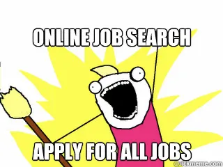
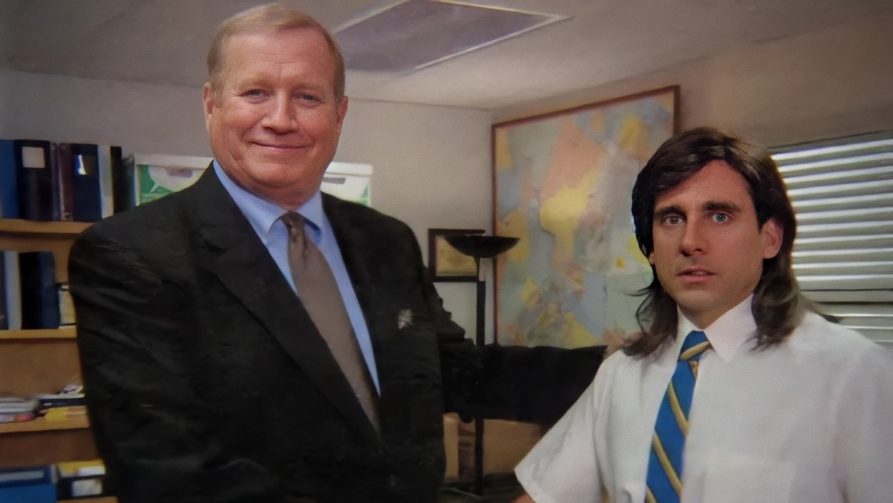

import WideImage from '../../components/blog/WideImage.astro'

<WideImage>
  
</WideImage>

## "Could you please introduce yourself to us?"

I'm Lasitha Prabodha Weligampola, a software developer with extensive experience in technologies like Angular, React, TypeScript, C#, ASP.NET Core, SQL, and Azure. 
Over the years, I've had the privilege of working for companies in Sri Lanka, US and Norway, and now I'm continuing my journey in Canada. 
Throughout my career, I've been deeply involved in building complex web applications, mentoring developers, and leading teams to success.

## New Adventure

Moving to Canada and trying to find a job was an adventure I knew would be challenging, but I didn't expect just how tough it would be. 
Despite my experience, I found myself applying to job after job, each time tweaking my resume and cover letter to fit the role. 
But more often than not, I heard nothing back, or I faced rejections.

It was hard not to get discouraged. There were days when I wondered if I was missing something or if my experience didn't translate well in the Canadian job market. 
Every application felt like a shot in the dark, and after so many, it was easy to start feeling like I was just spinning my wheels. 
But I kept at it because I knew the right job was out there somewhere. I just needed only one yes. 

I learned to adapt, kept improving my skills, and tried not to let the setbacks get to me too much.

## The Job Search Journey

When I first started my job search in Canada, 

> I was optimistic. 

With my experience and background in tech, I thought it would be a matter of weeks before I found the right role. 
At the beginning, I was confident that my experience in full-stack development would quickly land me interviews and offers. 
But after applying to dozens of jobs and receiving either rejections or no responses at all, 
I realized that finding a job in this country was going to be a lot tougher than I had anticipated.

As my initial expectations faded, I realized I needed to change my approach. 
I began refining my resume and cover letters even more, tailoring them specifically to each job description. 
I understood that in a competitive job market, it's not just about applying to jobs, it's about making connections and getting your name out there. 
But guess what? 

> That didn't go as planned. 

Due to job-hunting anxiety, my interactions with others started to decline.

But there was one interaction that I could not be avoided, interviews. 
I had to focus heavily on improving my interview skills, which was a significant challenge for me. 
Speaking confidently in interviews, especially in a new environment, wasn't easy. I practiced with friends, participated in mock interviews, 
and did everything I could to get more comfortable with the process. 

## Rejections 

The journey was far from smooth. There were days when the rejections were hard to take, and the lack of responses left me wondering if I was doing something wrong. 
I often found myself struggling to express my thoughts clearly, especially when nerves kicked in. 
Every rejection stung, and each unanswered application felt like a step backward.

But through it all, I kept reminding myself that each setback was a learning opportunity. 
I took every bit of feedback to heart, used it to refine my approach, and kept pushing forward. Slowly but surely, I started to see progress.

## What Kept Me Motivated

The job search was tough, but there were a few things that kept me going even when the rejections piled up. 
The first and biggest motivation was my wife. She's been an incredible source of strength for me. Back home, she worked as a software quality assurance engineer, 
but when we moved to Canada, she took on a completely new role, working hard at a restaurant. She tried many months looking for a role in her experienced field, 
but luck was not on her side. Seeing her adapt to such a different environment and work tirelessly to support us was a huge push for me. 
I couldn't stand the thought of sitting at home while she worked her ass off to cover our apartment rent and groceries.

Besides my wife, there were other things that helped me stay motivated. 
To bring some structure to my days and make the job search process feel less overwhelming, 
I created a daily routine. I set a schedule for each day of the week, dedicating 10 hours per week to applying for jobs, 
another 10 hours to learning something new, and 10 hours to my part-time remote job. 
The rest of my time was filled with college studies, which, thankfully, didn't pose much of a challenge for me. 

I also bought a domain to publish my thoughts online. Writing became a way for me to relax and take my mind off the stress of the job search. 
Each blog post felt like a small accomplishment, giving me a sense of purpose and progress. I believe this might have helped me get shortlisted for interviews as well. 

Lastly, I took up some side projects and online courses to keep my skills sharp. 
These activities allowed me to continue learning and stay productive, even when job offers weren't coming in. 
They not only kept my mind engaged but also provided a much-needed sense of achievement, which was crucial for maintaining a positive outlook. 

## Changes to My Approach

As I navigated through the job search process, I made several changes to my approach that eventually led to success. 
Initially, I believed that applying to as many positions as possible would increase my chances, but I quickly realized that quality mattered more than quantity. 
I began customizing my resume and cover letters meticulously for each job, aligning them with the specific requirements. 

 

You might be thinking this approach has improved my chances of getting noticed, but no. There was no change. 
This led me to take a step back and reflect on my work experiences. I focused on identifying the core skills I had gained and how best to express them. 

The key was in,

> simplifying and sharpening my presentation.

I revamped my resume with active language, short sentences, and concise bullet points, five to six key highlights per company that showcased my strengths. 
I trimmed down content from my earliest experiences, as they were too old to be relevant.
I also ensured it was a one-page resume, making it easier for recruiters to quickly grasp my qualifications. This streamlined approach made a significant difference.

Another change was my approach to interviews. I invested more time in preparing for each interview by researching the companies thoroughly and practicing my responses to common questions. 
I also worked on improving my communication skills to express my thoughts more clearly and confidently. 
This preparation helped me perform better in interviews and left a positive impression on potential employers.

## The Job Offer

 

The moment I received the job offer was surreal. After months of hard work and persistence, it felt like a weight had been lifted off my shoulders. 

> I remember reading the offer letter multiple times just to make sure it was real. 

I chose to accept the offer because it aligned perfectly with my career goals, offered opportunities for growth, and had a work culture that resonated with my values. 
The excitement of starting a new chapter in my career, combined with the sense of accomplishment, made it all worth the effort.

## Advice to My Fellow Job Seekers

To those currently navigating their job search, my biggest piece of advice is to remain persistent. 
The job search process can be daunting and often discouraging, but it's crucial to keep going. 
While it's common advice to customize your application for each role, it's also important to recognize when a job aligns with your experience and skills. 
Instead of being a jack of all trades, consider maintaining one strong resume that highlights your core strengths. 

Focus on networking and building connections within your industry. Don't be afraid to ask for feedback. It can provide valuable insights for improvement. 
Continuous learning is essential, whether it's honing your skills or gaining a deeper understanding of the job market. 

## Looking Forward

As I step into this new role, I am filled with optimism and determination. My goals are to excel in my responsibilities, contribute meaningfully to my team, 
and continue growing both personally and professionally. I'm grateful for the journey that brought me here.

## Closing Thoughts

Reflecting on my experience, I've come to realize that the job search is as much about personal growth as it is about finding the right role. 
The challenges and setbacks along the way are what make the eventual success so rewarding. 
To anyone still searching, I encourage you to stay positive, keep learning, and trust in your journey. The right opportunity is out there, you need only one yes.
