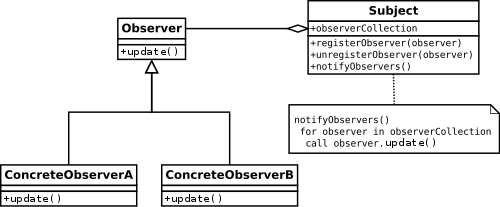

Think of yourself as a news enthusiast eagerly awaiting updates on your favourite topics. The Observer Pattern smoothly links you (the Observer) to the news platform (the Subject).

In this blog, we'll dive into understanding this pattern. We'll cover its basics, explore real-world uses, and equip you with the knowledge to wield this powerful design pattern in your projects.

## So, what exactly is the Observer Pattern?

It's a behavioural design pattern that fosters a <strong>one-to-many relationship</strong> between elements. Essentially, one element, the <strong>Subject</strong>, monitors its own state and keeps a list of dependent elements, the <strong>Observers</strong>. When the Subject's state changes, it notifies all its Observers, keeping them up to date and enabling them to react accordingly.


<small>UML diagram for Observer Pattern (<a href="https://en.wikipedia.org/wiki/Observer_pattern" target="_blank" rel="noreferrer">Wikipedia</a>)</small>

Picture it as subscribing to a news feed. You don't need to constantly refresh the website; the platform (Subject) automatically delivers updates to you (Observer) whenever there's news. This eliminates the need for constant checking and keeps everyone informed seamlessly.

But the Observer Pattern isn't just handy for news. It's a versatile tool applicable in various scenarios, from monitoring stock markets to designing user interfaces, ultimately enhancing software development efficiency and adaptability.

## Implementing the Observer Pattern

The Observer Pattern thrives in TypeScript's strong typing and interface capabilities. Let's build a news publisher-subscriber system to showcase its implementation

### Step 1: Defining the Interfaces

First, we'll define interfaces for the Subject and Observer:

```ts
interface Subject<T> {
    registerObserver(observer: Observer<T>): void;
    unregisterObserver(observer: Observer<T>): void;
    notifyObservers(data?: T): void;
}

interface Observer<T> {
    update(subject: Subject<T>, data?: T): void;
}

// used for our example
interface Article {
    topic: string;
    title: string;
    content: string;
}
```

<strong>Subject<T></strong> defines the core functionality of a "source" object responsible for notifying its dependents.

- `registerObserver(observer: Observer<T>)` adds an Observer to the notification list.
- `unregisterObserver(observer: Observer<T>)` removes an Observer from the list.
- `notifyObservers(data?: T)` triggers notifications to all registered Observers, optionally providing data.

<strong>Observer<T></strong> defines the behaviour of an object that "listens" for updates from a Subject.

- `update(subject: Subject<T>, data?: T)` is called by the Subject whenever a change occurs, providing optional data.

### Step 2: Concrete Implementations

Now, let's create concrete classes for a "NewsPublisher" (Subject) and "NewsSubscriber" (Observer)

```ts title="implementation.ts"
class NewsPublisher implements Subject<Article> {
    private observers: Observer<Article>[] = [];
    
    name: String = ""
    articles: Article[] = []; // array to store published articles

    constructor(name: String) {
        this.name = name;
    }

    registerObserver(observer: Observer<Article>): void {
        this.observers.push(observer);
    }

    unregisterObserver(observer: Observer<Article>): void {
        const index = this.observers.indexOf(observer);
        if (index !== -1) {
            this.observers.splice(index, 1);
        }
    }

    notifyObservers(article?: Article): void {
        for (const observer of this.observers) {
            observer.update(this, article);
        }
    }

    publishArticle(topic: string, title: string, content: string): void {
        // Simulate article creation
        const article = { topic, title, content };
        articles.push(article)
        this.notifyObservers(article);
    }

}

class NewsSubscriber implements Observer<Article> {
    constructor(
      private readonly name: string, 
      private readonly topics: string[]
    ) { }

    notify(subject: Subject<Article>, article?: Article): void {
        if (subject instanceof NewsPublisher && article) {
            if (this.topics.includes(article.topic)) {
                // Simulates the behavior of sending an email
                console.log(`Hey ${this.name}, There is a new article from ${subject.name} "${article.topic}": ${article.title}`);
            }
        }
    }

    subscribe(topic: string): void {
        this.topics.push(topic);
    }

    unsubscribe(topic: string): void {
        const index = this.topics.indexOf(topic);
        if (index !== -1) {
            this.topics.splice(index, 1);
        }
    }
}
```

<strong>NewsPublisher</strong> implements the `Subject<Article>` interface and manages subscribed news topics.

- Stores a list of `Observer<Article>` objects (subscribers).
- `publishArticle` method triggers notifications to relevant subscribers with the new article information.
- Maintains an `articles` array to store published articles for reference.

<strong>NewsSubscriber</strong> implements the `Observer<Article>` interface and handles topic-specific updates.

- Stores subscribed topics in the `topics` array.
- `update` method filters received articles based on its subscribed topics and logs notifications.
- Includes `subscribe` and `unsubscribe` methods for dynamic topic management.

### Usage

```ts title="usage.ts"
const publisher = new NewsPublisher("CNN");
const amal = new NewsSubscriber("Amal", ["sports", "technology"]);
const kamal = new NewsSubscriber("Kamal", ["entertainment", "politics"]);

publisher.registerObserver(amal);
publisher.registerObserver(kamal);

// Subscriber can subscribe/unsubscribe dynamically
amal.subscribe("entertainment");
kamal.unsubscribe("entertainment");

publisher.publishArticle("sports", "Sri Lanka Wins!", "...");
publisher.publishArticle("technology", "New iPhone is out!", "...");
publisher.publishArticle("entertainment", "Johnny and Amber married again!", "...");
publisher.publishArticle("politics", "Mahinda dead!", "...");
```


### Output

```bash
Hey Amal, There is a new article from CNN "sports": Sri Lanka Wins!
Hey Amal, There is a new article from CNN "technology": New iPhone is out!
Hey Amal, There is a new article from CNN "entertainment": Johnny and Amber married again!
Hey Kamal, There is a new article from CNN "politics": Mahinda dead!

```


This is a simplified example. Use libraries like <a href="https://rxjs.dev/guide/overview" target="_blank" rel="noreferrer">`RxJS`</a> for advanced features and real-world scenarios.

## Real-world examples

The Observer Pattern's versatility shines in various domains, making it an important quality of elegant software design. Let's explore some concrete examples:

1. GUI Updates

   - <strong>Spreadsheet Cells:</strong> When you edit one cell in a spreadsheet, other cells dependent on its value automatically update, demonstrating the Observer Pattern in action. The edited cell acts as the Subject, notifying dependent cells (Observers) of the change, prompting them to recalculate themselves.
   - <strong>Progress Bars:</strong> Progress bars often represent the state of an ongoing task. By subscribing to updates from the task, the progress bar acts as an Observer, displaying the latest progress information received from the Subject (task).

2. Event Handling
   - <strong>Button Clicks:</strong> When you click a button, it acts as the Subject, notifying event listeners (Observers) about the click event. These listeners could trigger various actions based on their specific interests, like opening a new window or playing a sound.
   - <strong>Keyboard Strokes:</strong> Similar to button clicks, key presses notify registered event listeners (Observers) about the pressed key, enabling keyboard shortcuts and interactive features.


3. Pub/Sub Systems

   - <strong>Messaging Apps:</strong> Chat platforms like Slack or Discord utilize the Observer Pattern extensively. Channels act as Subjects, notifying subscribed users (Observers) when new messages arrive. This ensures users only receive updates relevant to their subscribed channels.
   - <strong>News Aggregators:</strong> Services like Feedly allow users to subscribe to various news feeds (Subjects). When new articles are published, the feeds notify their subscribers, enabling them to stay updated on their chosen topics.

4. Interesting Use Cases in Libraries and Frameworks
   - <strong>React's Component State Management:</strong> In React, components act as Observers, subscribing to changes in their parent component's state. Whenever the parent's state changes, the child components are notified and re-rendered accordingly.
   - <strong>RxJS (Reactive Extensions for JavaScript):</strong> This popular library heavily leverages the Observer Pattern for reactive programming. Observers subscribe to Observables (Subjects) and receive data streams over time, enabling powerful asynchronous programming models.

These are just a few examples, and the Observer Pattern has applications in many other areas like data fetching, network monitoring, and collaborative editing. Its power lies in its ability to establish loosely coupled, efficient communication between objects, making it a valuable tool for developers across various domains.


## Best Practices

- Keep Subjects and Observers <strong>independent</strong>, minimizing direct dependencies. This promotes flexibility and maintainability.
- Use <strong>interfaces</strong> to establish contracts for Subjects and Observers, ensuring clarity and consistency.
- Allow Observers to <strong>dynamically subscribe/unsubscribe</strong> to receive relevant updates.
- Be mindful of situations where Subjects and Observers indirectly affect each other, leading to infinite loops. Consider <strong>breaking circular dependencies</strong> through design changes.
- Properly remove Observers from Subject lists to prevent unnecessary references and <strong>memory leaks.</strong>
- Consider <strong>leveraging libraries</strong> like RxJS (JavaScript), Guava or RxJava (Java) for advanced features and easier implementation.

## Anti-Patterns to Avoid

- Avoid creating a Subject that knows too much about its Observers and their logic. Maintain clear separation of concerns.
- Overly coupled Subjects and Observers make code less adaptable and harder to maintain. Strive for loosely coupled interactions.
- Avoid changing the Subject's state within Observer updates. This can lead to unintended side effects and complexities.
- <strong>Don't force-fit</strong> the Observer Pattern into every situation. Consider alternatives like pub/sub systems for more complex event broadcasting scenarios.

## Conclusion

We've uncovered the Observer Pattern's secrets, from its basic concepts to practical implementations. It's more than simply Subjects and Observers; it's about creating a smooth flow of information within your software.

And for your learning journey:

- Dive deeper with the <a href="https://www.amazon.com/gp/product/0201633612/" target="_blank" rel="noreferrer">"Gang of Four"</a> Design Patterns book or online resources specific to your language.
- Experiment with the pattern in different scenarios to solidify your understanding.
- Share your experiences and insights with the developer community!

<strong>Happy Coding!</strong>
