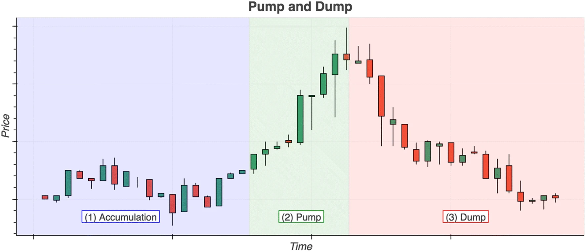
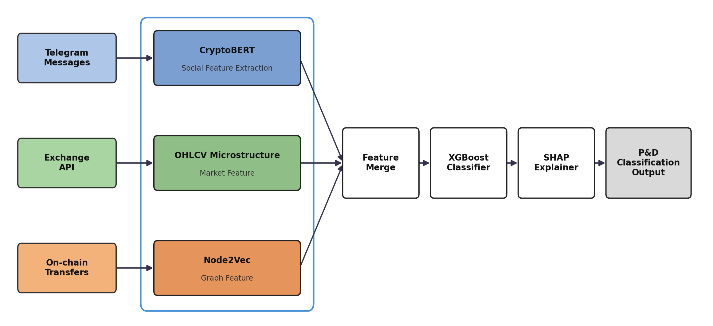
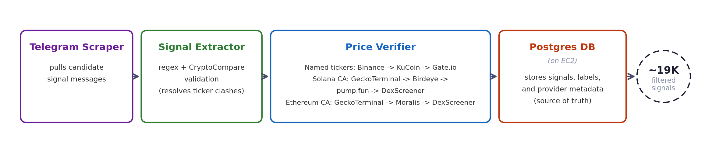

import WideImage from '../../components/blog/WideImage.astro'

If you've spent any time in low-cap crypto Telegram groups, you know the feeling:

<WideImage>
  
</WideImage>

A quiet token suddenly gets flooded with "🚀🚀 LOAD UP NOW 🚀🚀" messages, the price spikes 300% in twenty minutes, 
and by the time most people notice, it's already crashing back down. That's a pump-and-dump - and despite being one 
of the oldest scams in finance, it's thriving in crypto because the tooling to catch it hasn't kept up with how it 
actually happens.

Most existing detection approaches look at one signal in isolation: either the language around a token 
(hype, urgency, coordinated posting) or the price action (sudden volume spikes, abnormal volatility). 
Both are useful, but both are also easy to fake or dodge individually. Bad actors know how to write around 
keyword filters, and they know how to structure trades to blend in with normal volatility.

The approach I've been building for my dissertation treats this as a three-signal problem instead of 
a one-signal problem - combining natural language, on-chain graph structure, and market behavior into 
a single model, rather than betting everything on any one of them.

<small>Anatomy of a pump-and-dump (<a href="https://link.springer.com/article/10.1186/s40163-018-0093-5" target="_blank" rel="noreferrer">To the moon: defining and detecting cryptocurrency pump-and-dumps</a>)</small>

## Why one signal isn't enough

A pump group's Telegram messages can look suspicious without any accompanying market activity - 
people talk big all the time. A price spike can happen without any organized signal behind it - real news, 
real demand. It's the combination - coordinated hype, unusual wallet/trading structure, and anomalous price-volume 
behavior all lining up around the same token at the same time - that's the actual fingerprint of a pump-and-dump.

So the framework has three components, each targeting a different part of that fingerprint:

1. NLP - what's being said, and how
2. Graph analysis - who's trading, and how they're connected
3. Market anomaly detection - what the price and volume are actually doing

Each one feeds into a final classifier as a separate group of features, rather than being reduced to 
a single "suspicious/not suspicious" score up front. That matters - a lot of the signal is in how 
these three things move together, and you lose that if you collapse each channel down too early.

Rewording a message to dodge a keyword filter is trivial. Faking coordinated wallet structure and 
a matching volume anomaly and plausible language, all at once, is a lot harder - which is the whole argument 
for going tri-factor in the first place.

## Component 1: Reading the hype with CryptoBERT

For the language side, I used CryptoBERT rather than a general financial NLP model like FinBERT. 
This was a deliberate choice: crypto Telegram text doesn't look like financial news or SEC filings. 
It's full of slang, emoji, deliberately obfuscated ticker mentions, and a hype register that's specific 
to the space ("gem," "moon," "ape in," coordinated countdown messages). A model trained on general financial 
sentiment doesn't have that vocabulary baked in - CryptoBERT does, since it's pretrained on crypto-specific 
social text. I did briefly consider whether a general model could just learn it on the fly.

The NLP layer isn't just doing sentiment analysis, either. Pump groups have a fairly recognizable structure 
to how they announce a target - timing patterns, message clustering, phrasing that signals 
"this is happening now" versus generic bullishness. That structural signal is arguably more  
useful than sentiment on its own.

## Component 2: Mapping relationships with Node2Vec

The second piece looks at on-chain graph structure - essentially, who's connected to whom, and how. 
Pump-and-dumps often rely on a coordinated core of wallets acting early, followed by organic buyers 
piling in once the price starts moving. That produces a graph shape that's different from a token's 
normal trading pattern.

I used Node2Vec to generate embeddings from these wallet/token interaction graphs. Node2Vec works by 
running biased random walks over the graph and learning vector representations that preserve structural 
relationships - so wallets that play similar roles in the network end up close together in the embedding space, 
even if they've never directly interacted. That's useful here because it can surface coordinated clusters that 
wouldn't be obvious from just looking at transaction volume.

## Component 3: Catching the price action, adjusted for the times

The third component is more classical anomaly detection on price and volume - but with a twist: 
adaptive thresholds by year. Crypto market volatility isn't stable over time. What counts as an 
"abnormal" price spike in a relatively calm market is completely different from what counts as abnormal 
during a broader bull run, when everything is moving fast. A fixed threshold either misses pumps during 
quiet periods or flags half the market during hot ones. Letting the thresholds adapt year-by-year keeps 
the anomaly detection calibrated to the actual market regime instead of a single static baseline.

## Bringing it together: XGBoost + SHAP

<WideImage>

</WideImage>

All three feature groups - NLP-derived features, graph embeddings, and market anomaly scores - 
feed into an XGBoost classifier. XGBoost is a good fit here because it handles heterogeneous, 
tabular-style feature sets well without needing everything to be on the same scale or distribution, 
and it's forgiving of the kind of messy, imbalanced data this problem produces (real pump-and-dumps are, 
thankfully, a small minority of all token activity).

The other reason XGBoost matters here is that it plays nicely with SHAP (SHapley Additive exPlanations). 
Accuracy alone isn't enough for something like this - if you're going to flag a token as a likely pump-and-dump, 
you need to be able to say why. SHAP breaks each prediction down into the contribution of individual features, 
which means a flagged token isn't just "the model said so" - you can point to exactly which signals drove the call: 
was it the language, the wallet structure, the price behavior, or some combination? That's the difference 
between a model that's useful for research and one that could actually be trusted by an exchange or a regulator.

## The unglamorous part: building the data pipeline

None of the modeling matters if the underlying data is unreliable, and this is where most of the actual 
engineering time has gone. The pipeline (I've been calling it verify-pumps internally) has a few stages:

<WideImage>

</WideImage>

- **Telegram scraping** to pull candidate signal messages from pump groups
- **Signal extraction**, using regex plus validation against CryptoCompare, to figure out which 
token a message is actually about (ticker collisions are a real problem - plenty of tokens share names)
- **Price verification**, cross-checking against DexScreener, GeckoTerminal, Birdeye, and Moralis, 
since no single price source is reliable enough on its own for low-liquidity tokens
- **A Postgres database** underneath it all, with contract-address-based re-verification logic to 
catch cases where a token gets redeployed under a new contract but keeps trading under the same name - 
running on an EC2 instance, which turned out to matter more than expected once the scraper needed to run 
continuously rather than in short local bursts

So far this has produced somewhere around 19,000 filtered signals to work with - enough to make the 
graph and NLP components meaningful, but getting there involved a lot of unglamorous data-cleaning work 
that doesn't show up in any diagram of the model architecture.

## What's next

The methodology is built; what's left is finishing the evaluation and tightening the pipeline further - 
particularly around edge cases like contract redeployment, which turns out to be a more common evasion 
tactic than I expected going in. I'll follow up with a post on the actual results once the dissertation wraps up.

If you're working on anything adjacent - fraud detection, graph-based anomaly detection, or crypto 
market microstructure - I'd be curious to hear how you're approaching the same problem.

And if anyone asks how confident the model is:

> This post is based on my ongoing MSc dissertation research into cryptocurrency pump-and-dump detection.