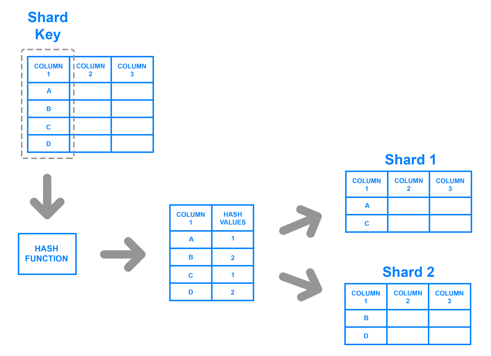
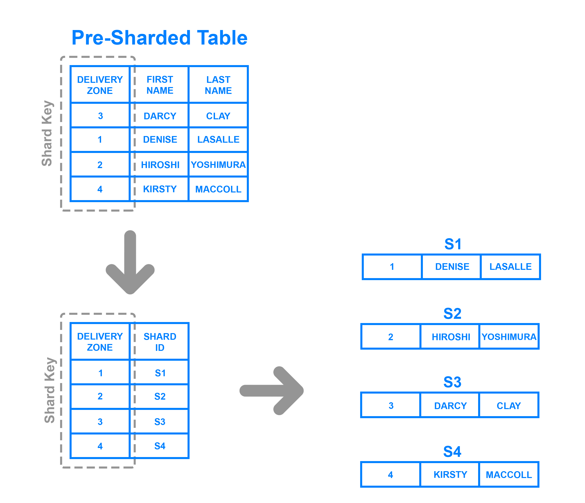

import WideImage from '../../components/blog/WideImage.astro'

<WideImage>
  
</WideImage>

## Introduction to Sharding

As data grows, and enterprises grow, conventional databases can become a problem. 
Slow queries, increased downtime, and high operational costs can become a big problem, kind of like trying to find a single sock in a laundry basket full of unmatched pairs. 
But this is where <strong>sharding</strong> comes in, a healthy approach of dividing a large database into multiple smaller databases also known as <strong>shards</strong>.

Sharding is not the same as simple database replication. It does not mean to maintain several copies of the same data, but to <strong>divide</strong> the data into pieces and place them in different locations. 
So the queries are executed faster and the efficiency of the systems is maintained.
Social networks like Facebook, Twitter, and even e-commerce giant Amazon use sharding to handle thousands or even millions of users and maintain the performance of their sites as traffic increases.

## How Sharded Databases Work

At its core, a sharded database is a collection of smaller databases (shards) that hold a part of the total data. 
These shards are independent but combined they make one large system. 
<strong>A shard key</strong> is used to decide where the data is stored, it's like having an address that points data in the right direction. 

We can take a shopping site that uses customer ID as a shard key as an example for this. 
A specific shard is where all of a customer's orders and interactions are stored. 
In this manner, the system only needs to look at the shard associated with that user, which is much faster, rather than searching 
through millions of records when a person wants to sign in and view their purchase history. 
Nobody wants to wait thirty seconds for their shopping cart to load, especially when there is a Black Friday sale, right?

## Types of Sharding

There is no single approach to Sharding. Different businesses are different and thus different approaches can be taken when it comes to sharding a database:

    1. <strong>Range-Based Sharding:</strong> 
        The data is divided based on the range of values. 
        For instance, users with ID between 1 and 10,000 can be placed in one shard and 10,001 - 20,000 in another. 
        The method is quite simple to implement but it has a drawback that some shards may be more populated than others especially if some shards are more prone to high traffic than others.
        
        

    2. <strong>Hash-Based Sharding:</strong> 
        A hash function determines the location of data to be stored. 
        This results in a more even data distribution across the shards but at the same time makes it harder to introduce new shards.
        
        

    3. <strong>Directory-Based Sharding:</strong> 
        A lookup table is used to determine where each piece of data is located. 
        It is the most flexible of the four approaches but the directory can be difficult to manage.
        
        

## Why Businesses Use Sharding

One of the primary motives for which organizations embrace sharding is scalability. 
When it comes to the size of users, a single database cannot manage all the traffic that is being received. 
Sharding enables enterprises to horizontally scale. This means that instead of having to upgrade a single, overburdened server, they can just introduce more database instances. 
 
Another major benefit is the performance. It is faster because each shard has a copy of the data in fraction of the size. 
It is like searching for a file in a huge warehouse as opposed to searching for it in a small storage room, there is less to sort through. 
Furthermore, sharding enhances the resilience to failure since if one shard fails, it impacts only a part of the system and not the whole application. 

## The Downsides of Sharding

Yet, sharding is not the end of the problem, it has its issues. 
The major issue is complexity. Maintaining a database that has been sharded is an exponential increase in complexity. 
Developers also have to think carefully about shard keys to avoid performance bottlenecks, and they have to consider cross shard queries which are slow. 

Another issue is rebalancing. Systems grow, some shards will become overloaded while others will be underutilized. 
Rebalancing data across shards can be complicated and may entail downtime or extra infrastructure. 
Therefore, companies should use sharding only if other improvements, such as caching, indexing, or replication, are insufficient.

## When Should You Use Sharding?

Sharding is most useful in applications that are handling very large  amounts of data and user interactions. 
If your database is experiencing slow queries, or if you are incurring high storage costs, or even down time, then sharding might be worth considering. 
But if a system can run without a problem because of caching or indexing then sharding may bring more complexity than it needs.

## Final Thoughts

Sharding is a great way for handling large scale and high traffic applications but it is not for everyone. 
But at the same time, it is worth noting that it improves scalability and performance at the expense of complexity and maintenance.
Therefore, businesses should carefully assess their needs beforehand and find out if there are other means of achieving the same result 
(such as indexing, caching, or replication) instead of turning to sharding. 

If done  right, sharding can be the lifesaver that enables organizations to future proof their databases, grow with out  sacrificing speed or reliability.

## References

1. MongoDB Documentation. "Sharding in MongoDB." <a href="https://www.mongodb.com/docs/manual/sharding/">https://www.mongodb.com/docs/manual/sharding</a>
2. Citus Data. "Scaling PostgreSQL with Sharding." <a href="https://www.citusdata.com">https://www.citusdata.com</a>